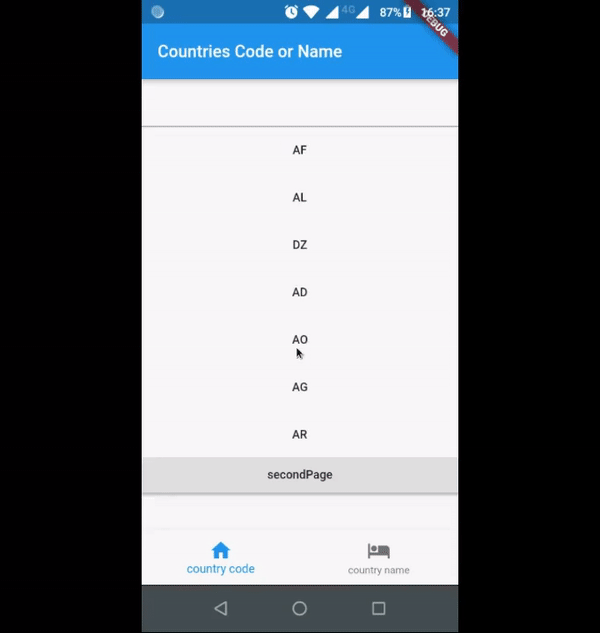
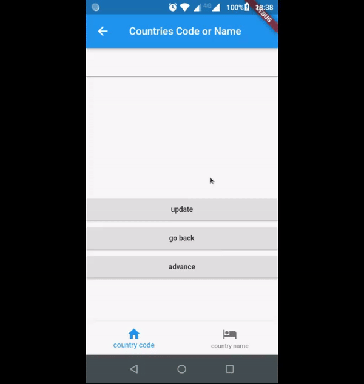

# Getting Location (Português)

Um projeto Flutter usando [GetX Pattern](https://kauemurakami.github.io/getx_pattern/?fbclid=IwAR1ejnKLnVZxJ9Diora2GI0ghEIIeKuvIjpmIUr2-QR1nZ_lf5UgQWzUjt4#home), [Get State Manager](https://pub.dev/packages/get) e [Appwrite](https://appwrite.io/) BAAS. 

## Getting Started

1. **O que o aplicativo faz?**
2. **Usando Obx (RxController)**
3. **Usando GetBuilder (GetController)**
4. **Usando GetX (RxController)**
5. **Por quê usar GetController?**
6. **Usando diferentes providers num mesmo repository**

### O que o aplicativo faz?

O aplicativo retorna uma lista de códigos e nomes de países, assim como a sua própria localização, usando o serviço Appwrite Locale, o package Geolocator e as gerências de estado de Get (Obx e GetX com RxController e GetBuilder com GetController) - O usuário pode filtrar a lista de códigos ou países através de um TextField, que responderá com base em qual gerenciador de estado está sendo usado no momento. O aplicativo tem três páginas Home, Home2 e Address e duas guias cada (uma para códigos de países e outra para nomes de países), exceto Address. O filtro faz distinção entre maiúsculas e minúsculas, logo, se você colocar 'a' e 'A' depois disso, os resultados não serão os mesmos. A localização retorna apenas a cidade e o estado da pessoa, podendo retornar muito mais detalhes. 

### Usando Obx (RxController)

A principal diferença entre Obx (ou GetX) e GetBuilder está no fato de que: GetBuilder (GetController) depende do uso do método update() para alterar o estado do widget, enquanto Obx/GetX (RxController) não. Neste exemplo, na primeira página, depois de colocar algo no filtro, a lista será alterada automaticamente para você. Você não precisa fazer mais nada. Em outras palavras, se você quiser algo **reativo**, algo que será "atualizado sozinho", use RxController e Obx (ou GetX). Eu usei a função onChanged no widget TextField para atualizar minhas variáveis de filtro e a lista, logo, no widget ListView.builder, a lista muda automaticamente. 

### Usando GetBuilder (GetController) 

Quando você vai para a segunda página, a lista não se atualiza sozinha, é necessário pressionar o botão update, que possui o método update() do controller. Então, quando você pressiona o botão, a lista muda. Se você escrever algo no TextField, ele não será filtrado sozinho, você deverá pressionar o botão. 

"Espera aí, os dois métodos para atualizar countriesCode e countriesName estão na função onChanged do widget TextField, por que não muda sozinho?" 
Porque se você entrar no HomeController2, verá que não há o método update(), para que não funcione automaticamente. Se você deseja que a segunda tela aja como a primeira, você precisará apenas acrescentar o método.

### Usando GetX (RxController)

Quando você vai para a terceira página, ela irá perguntar para acessar a localização. Caso não esteja ligada, ligue-a. Após alguns segundos, a sua cidade e estado aparecerão na tela. Isso porque o GetX tem o parâmetro initState (assim como o GetBuilder e diferente do Obx), onde eu posso fazer com que coisas se carreguem assim que o widget GetX é carregado. Montei o exemplo para mostrar apenas cidade e estado, mas é fácil colocar para mostrar mais informações que foram obtidas pelo package Geolocator. 

### Por quê usar GetController?

Nesse cenário, a API Appwrite Locale não me custa nada. Estou livre para usá-la de graça! Mas, se não fosse grátis, eu teria que estar realmente consciente do seu uso. Neste exemplo, consumi mais de mil solicitações usando-o por 5 minutos, porque a função onChanged notifica cegamente qualquer "alteração" - mesmo que eu não escreva nada, ele notifica. Portanto, se 100 solicitações me custarem um dólar, com o GetController, eu teria que pagar apenas um dólar, porque fiz muito menos do que 100 cliques, quando com o RxController eu teria que pagar 10 dólares. Ou seja, GetController e GetBuilder são minha escolha de ouro, porque caso fosse um aplicativo a ser lançado no mercado, obviamente eu consumiria mais de 1000 requisições.

### Usando diferentes providers num mesmo repository

O GetX Pattern separa o provedor de dados do repositório de informações, pois é possível haver mais de um provedor para o mesmo respositório. Um exemplo bem trivial é caso você tenha que utilizar duas APIs para cumprir papéis semelhantes, você pode concentrar as duas num mesmo repositório e manter a lógica de separação lá, enquanto seu controller recebe apenas um repository e ficando apenas com os dados entregues pelo repositório direto, sem precisar carregar ainda mais o controller com lógica. Neste exemplo, os meus provedores de dados seriam tanto o package Geolocator como o serviço Locale do Appwrite. Funções semelhantes, porém distintas, sendo que é até possível obter alguns dados iguais em ambos os casos. 

#### P.S.

O GetBuilder e o GetX são muito semelhantes na sintaxe, por isso é válido comparar a sintaxe do GetX e do Obx usando o GetBuilder. Dito isto, optei por usar o Obx na primeira página em vez do GetX, apenas porque o Obx - nesse caso - possui um código mais limpo do que teria se tivesse escrito com o GetX. Visto que o Obx não ordena que eu use Get.put() ou Get.find() para simplesmente usar um controlador fora do meu widget. Não há nem mesmo binding neste código. **E o que torna este caso, "este caso"?** Eu realmente uso muito meu controlador fora do widget Obx, por isso Obx é a minha escolha. Tanto que na terceira usei GetX, por praticamente não precisar usar o controller fora do widget GetX

# Getting Location (English) 

A Flutter project using [GetX Pattern](https://kauemurakami.github.io/getx_pattern/?fbclid=IwAR1ejnKLnVZxJ9Diora2GI0ghEIIeKuvIjpmIUr2-QR1nZ_lf5UgQWzUjt4#home), [Get State Manager](https://pub.dev/packages/get) and [Appwrite](https://appwrite.io/) BAAS. 

## Getting Started

1. **What the app does?**
2. **Using Obx (RxController)**
3. **Using GetBuilder (GetController)**
4. **Using GetX (RxController)**
5. **Why use GetController?**
6. **Using differents providers in a same repository**

### What the app does?

The app returns a list of country codes and names, as well as your location itself, using the Appwrite Locale service, the Geolocator package and the Get state managers (Obx and GetX with RxController and GetBuilder with GetController) - The user can filter the list of codes or name of countries through a TextField, which will respond based on which state manager is currently being used. The application has three pages Home, Home2 and Address and two tabs each (one for country codes and one for country names), except Address. The filter is case-sensitive, so if you've put 'a' and after 'A', the results will not be the same. The location only returns the person's city and state, and can return much more details.

### Using Obx (RxController)

The major difference between Obx(or GetX) and GetBuilder is in the fact that: GetBuilder(GetController) depends on the use of the update() method to change the widget's state, while Obx/GetX(RxController) don't. In this example, in the first page, once you've put something in the filter, the list will automatically change for you. You don't have to do nothing more. In other words, if you want something **reactive**, something that will "update alone", you use RxController and Obx(or GetX). I've used the onChanged function from the TextField widget to update my filter variables and the list, so in the ListView.builder widget, the list changes automatically.

### Using GetBuilder (GetController) 

When you go to the second page, the list will not update itself alone, you have to press the update button, who has the update() method from the controller. So when you press the button, the list will change. If you write something on the TextField, it will not filter itself alone, you have to press the button. 

"But wait, both methods to update countriesCode and countriesName are on the onChanged function of the TextField widget, why it doesn't change alone?" 
Because if you go to Home2Controller, you will see that there is no update(), so they don't work automatically. If you want the second screen to act like the first, you only have to add update().

### Using GetX (RxController) 

When you go to the third page, it will ask you to access your location. Turn it on in case it's off. After a few seconds, your locality/sub administrative area and administrative area will be displayed. It happens because GetX have the initState parameter (as GetBuilder and diferently from Obx), where i can load things once the GetX widget is loaded. I've built this example to show only locality/sub administrative area and administrative area, but it is easy to show more informations obtained by the Geolocator package. 

### Why using GetController?

In this scenario, Appwrite Locale API doesn't cost me anything. I'm free to use it for free! But, if if wasn't, i'd have to be really conscious of its use. In this example, i've consumed more than one thousand requests using it for 5 minutes, because the onChanged function blindly notifies any "change" - even if i write nothing, it notifies. So, if 100 request cost me one dollar, with GetController i'd have to pay only one dollar, because i did way less than 100 clicks, when with RxController i'd have to pay 10 dollars. In other words, GetController and GetBuilder are my golden choice, because if it is an application launched on the market, obviously I will consume more than 1000 requests.

### Using differents providers in a same repository

The GetX Pattern separates the data provider from the information repository, as it is possible to have one more provider for the same repository. A very trivial example is the case where you use two APIs to perform similar parts. You can use both in one repositories and keep the storage logic there, while your controller receives only one repository and receives only the data delivered directly by the repository, without having to load further logic. In this example, my data providers can be both the package geolocator and the Appwrite Locale service. Similar but distinct functions, and it is even possible to obtain the same data in both providers.

#### P.S.

GetBuilder and GetX are a lot similar in sintax, so it's valid to compare the sintax of GetX and Obx using GetBuilder's. That said, i've opted to use Obx in the first page instead of GetX just because Obx - in this case - have a way cleaner code than it would have if i've written it with GetX. Because Obx doesn't order me to use Get.put() or Get.find() to simply use one controller out of my widget. There isn't even binding in this code. **And what makes this case, "this case"?** I really use my controller a lot out of the Obx widget. Because of this, Obx is my choice. In the third page, my choice was GetX because i don't use the controller out GetX widget.
